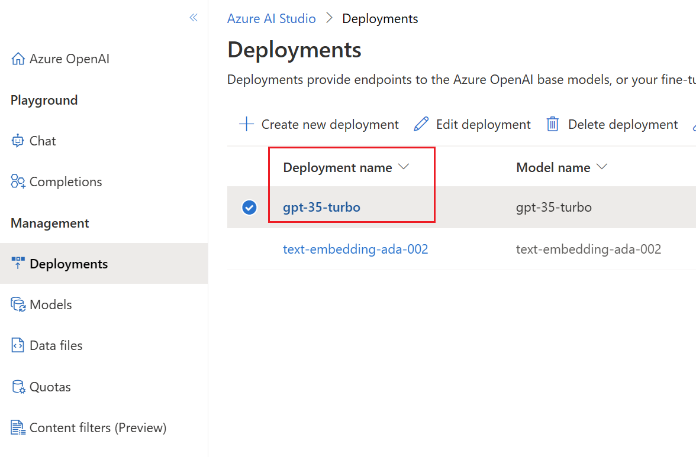

<h1 align="center">chatgpt-comment-analyzer</h1>
<div align="center">
Use LangChain and Azure OpenAI to analyze social media comments
</div>

## Introduction

This project is a quick demo for using LangChain and Azure OpenAI to build an LLM application to analyze social media comments. The logic is not complicated, but it is a good example to show how to use `prompt template` and `output parser` to effectivly manage the prompt and output, without manipulating the raw prompt string directly.

## Installation

1. Clone the repository:

```bash
git clone https://github.com/linjungz/chatgpt-comment-analyzer.git
cd chatgpt-comment-analyzer
```
2. Create python virtual environment:

```bash
python3 -m venv .venv
source .venv/bin/activate
```
3. Install depenancies:

```bash
pip install -r requirements.txt
```

## Configuration

1. Obtain your Azure OpenAI API key, Endpoint and Deployment Name from the [Azure Portal](https://portal.azure.com/).

2. Create `.env` in the root dir and set the environment variable in the file:

```
OPENAI_API_BASE=https://your-endpoint.openai.azure.com
OPENAI_API_KEY=your-key-here
OPENAI_DEPLOYMENT_NAME=your-gpt-deployment-name
```
Here's where you can find the deployment names for GPT-3.5 or GPT-4:


## Usage

1. The entry for the application is `app.py` :

```bash
$ python app.py --help
usage: app.py [-h] --input INPUT [--sheet SHEET] --output OUTPUT [--count COUNT]

Analyze comments from excel file

optional arguments:
  -h, --help       show this help message and exit
  --input INPUT    input excel file path
  --sheet SHEET    sheet name in the input excel file
  --output OUTPUT  output excel file path
  --count COUNT    number of comments to process
```

2. The prompt template is in `prompt_templates.py` which could be adjusted to fit your specific requirement.

3. Some comments extracted from social media are in `sample_input.xlsx` for testing purpose.